# 考勤系统数据库设计说明文档

## E-R 模型
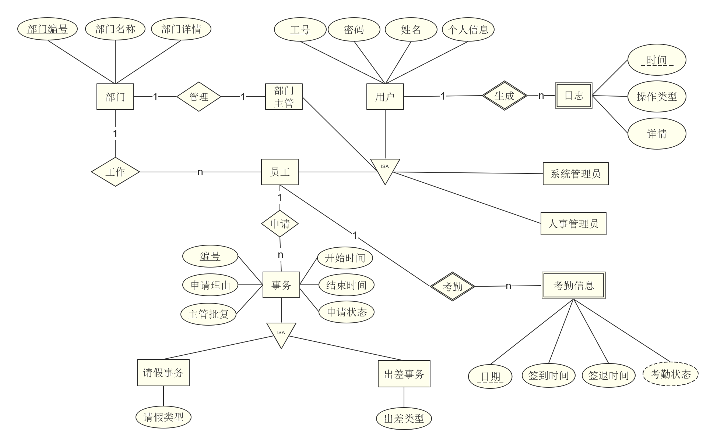

## 表结构

### 实体集

#### user

实体集 `user`，对应公司所有员工的一般化表示，共同属性为工号 `user_id`，密码 `password`，姓名 `name`。

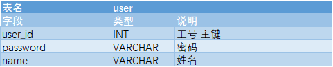

#### employee

实体集 `employee`，是 `user` 的特殊化，表示在部门工作的普通员工，其主键参照 `user` 的主键。

#### supervisor

实体集 `supervisor`，是 `user` 的特殊化，表示管理部门的部门主管，其主键参照 `user` 的主键。

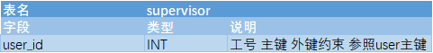

#### personnel_manager

实体集 `personnel_manager`，是 `user` 的特殊化，表示人事管理员，其主键参照 `user` 的主键。

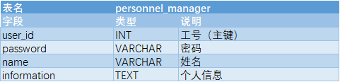

#### system_manager

实体集 `system_manager`，是 `user` 的特殊化，表示人事管理员，其主键参照 `user` 的主键。

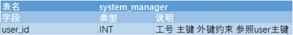

#### attendance_table

实体集 `attendance_table`，表示用户及其每天打卡情况，用户的 `user_id` 和打卡日期 `date` 共同构成主键。

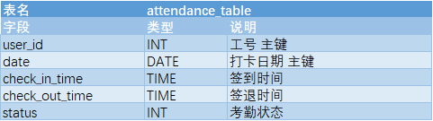

#### leave_table

实体集 `leave_table`，表示公司的请假表，主键为唯一且自动增长的 `leave_number`

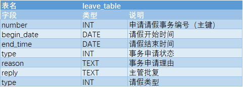

#### trip_table

实体集 `trip_table`，表示公司的出差表，主键为唯一且自动增长的 `trip_number`

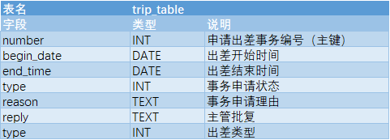

#### log

实体集 `log`，表示系统对每一次操作的记录，主键是操作对象的 `user_id` 和操作时间的时间戳 `datetime`

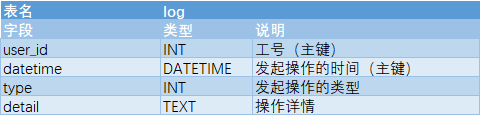

### 联系集

#### works_in

联系集 `works_in`，表示员工和其工作部门间的联系。

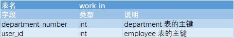

#### manage

联系集 `manage`，表示部门主管和其管理的部门。

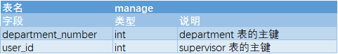

#### leave_apply

联系集 `leave_apply`，表示员工和他发起的请假申请间的联系。

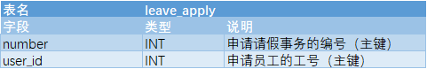

#### trip_apply

联系集 `trip_apply`，表示员工和他发起的出差申请间的联系。

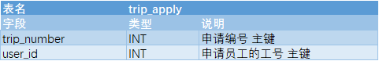
