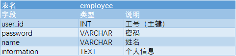
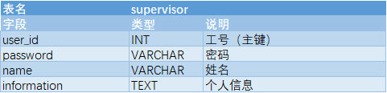
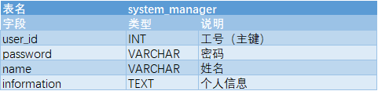
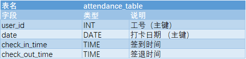

# 考勤系统数据库设计说明文档

## E-R 模型

## 表结构

### 实体集

#### employee

实体集 `employee`，是 `user` 的特殊化，表示部门工作的普通员工，具有属性 `user_id` 作为主键，以及属性 `password`、`name`、`information`。

#### supervisor

实体集 `supervisor`，是 `user` 的特殊化，表示一个部门的部门主管，具有属性 `user_id` 作为主键，以及属性 `password`、`name`、`information`。

#### personnel_manager

实体集 `personnel_manager`，是 `user` 的特殊化，表示公司的人事管理员，具有属性 `user_id` 作为主键，以及属性 `password`、`name`、`information`。

#### system_manager

实体集 `system_manager`，是 `user` 的特殊化，表示公司的系统管理员，具有属性 `user_id` 作为主键，以及属性 `password`、`name`、`information`。

#### attendance_table

实体集 `attendance_table`，表示用户及其每天打卡情况，用户的 `user_id` 和打卡日期 `date` 共同构成主键。

#### leave_table

实体集 `leave_table`，是事务的特殊化，表示公司的请假事务表，主键为唯一且自动增长的事务编号 `number`

#### trip_table

实体集 `trip_table`，是事务的特殊化，表示公司的出差事务表，主键为唯一且自动增长的事务编号 `number`

#### log

实体集 `log`，表示系统对每一次操作的记录，主键是操作对象的 `user_id` 和操作时间的时间戳 `datetime`

### 联系集

#### works_in

联系集 `works_in`，表示员工和其工作部门间的联系。

#### manage

联系集 `manage`，表示部门主管和其管理的部门。

#### leave_apply

联系集 `leave_apply`，表示员工和他发起的请假申请间的联系。

#### trip_apply

联系集 `trip_apply`，表示员工和他发起的出差申请间的联系。

